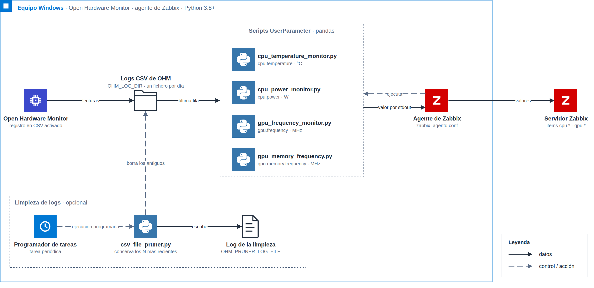

# Windows Monitoring Scripts

Colección de scripts en Python que leen los registros CSV generados por **Open Hardware Monitor** en Windows y devuelven un único valor numérico por salida estándar, pensados para usarse como `UserParameter` de **Zabbix Agent**.

## Descripción

[Open Hardware Monitor](https://openhardwaremonitor.org/downloads/) exporta periódicamente el estado de los sensores de hardware (temperatura, consumo, frecuencias, etc.) a archivos CSV. Cada script de este repositorio localiza el CSV más reciente, extrae un sensor concreto y escribe su último valor por salida estándar, en el formato que Zabbix Agent espera de un `UserParameter`.

## Cómo funciona

<p align="center"></p>

1. Open Hardware Monitor escribe las lecturas de los sensores en un CSV por día dentro de `OHM_LOG_DIR`.
2. El agente de Zabbix ejecuta el script asociado a cada `UserParameter`. El script abre el CSV del día (o el más reciente) y devuelve por salida estándar el último valor del sensor.
3. El agente entrega ese valor al servidor Zabbix.
4. De forma opcional, una tarea del Programador de tareas ejecuta `csv_file_pruner.py`, que conserva los N CSV más recientes y registra lo que borra.

El diagrama es editable: [`docs/diagrams/sensor-pipeline.drawio`](docs/diagrams/sensor-pipeline.drawio).

## Requisitos

- Python 3.8 o superior.
- Open Hardware Monitor en ejecución, configurado para exportar los datos a CSV.
- Zabbix Agent (opcional), para integrar los valores como `UserParameter`.
- Dependencias de Python listadas en `requirements.txt`.

## Instalación

```bash
git clone https://github.com/PedroFernandz/monitoring-windows.git
cd monitoring-windows
pip install -r requirements.txt
```

## Configuración

Todos los scripts localizan los CSV de Open Hardware Monitor en un directorio y con un prefijo de nombre configurables, con esta prioridad: **argumento de línea de comandos > variable de entorno > valor por defecto**.

| Argumento      | Variable de entorno | Descripción                                                | Valor por defecto                        |
| -------------- | -------------------- | ------------------------------------------------------------ | ------------------------------------------ |
| `--log-dir`    | `OHM_LOG_DIR`         | Directorio donde Open Hardware Monitor guarda los CSV.        | `C:\Program Files\OpenHardwareMonitor`     |
| `--log-prefix` | `OHM_LOG_PREFIX`      | Prefijo del nombre de archivo del CSV, antes de la fecha.     | `OpenHardwareMonitorLog-`                  |

`csv_file_pruner.py` admite además:

| Argumento      | Variable de entorno   | Descripción                                                | Valor por defecto              |
| -------------- | ----------------------- | ------------------------------------------------------------ | --------------------------------- |
| `--retention`  | `OHM_LOG_RETENTION`     | Número de CSV más recientes a conservar; el resto se elimina. | `2`                                |
| `--log-file`   | `OHM_PRUNER_LOG_FILE`   | Ruta del log de actividad propio del script.                  | `~\Documents\limpiar_csv.log`     |

Ejemplo con un directorio y un prefijo distintos a los de por defecto:

```bash
python cpu_temperature_monitor.py --log-dir "D:\OHM\Logs" --log-prefix "OhmLog-"
```

## Scripts

| Script                        | Valor devuelto                    | Unidad |
| ------------------------------ | ----------------------------------- | ------ |
| `cpu_temperature_monitor.py`   | Temperatura del paquete de CPU      | °C     |
| `cpu_power_monitor.py`         | Consumo del paquete de CPU          | W      |
| `gpu_frequency_monitor.py`     | Frecuencia del núcleo de la GPU     | MHz    |
| `gpu_memory_frequency.py`      | Frecuencia de la memoria de la GPU  | MHz    |
| `csv_file_pruner.py`           | Elimina los CSV antiguos (sin salida) | —    |

Los cuatro scripts de monitorización imprimen un único valor numérico por salida estándar; si el CSV no existe o el sensor no se encuentra, imprimen `0`.

## Integración con Zabbix

Agrega líneas como las siguientes al archivo de configuración de Zabbix Agent (`zabbix_agentd.conf`), ajustando las rutas del intérprete de Python y de los scripts a tu instalación:

```ini
UserParameter=cpu.temperature,"C:\Program Files\Python313\python.exe" "C:\zabbix\scripts\cpu_temperature_monitor.py"
UserParameter=cpu.power,"C:\Program Files\Python313\python.exe" "C:\zabbix\scripts\cpu_power_monitor.py"
UserParameter=gpu.frequency,"C:\Program Files\Python313\python.exe" "C:\zabbix\scripts\gpu_frequency_monitor.py"
UserParameter=gpu.memory.frequency,"C:\Program Files\Python313\python.exe" "C:\zabbix\scripts\gpu_memory_frequency.py"
```

Si el directorio de logs de Open Hardware Monitor no es el que cada script usa por defecto, indícalo con `--log-dir` (o con la variable de entorno `OHM_LOG_DIR` en el entorno del agente):

```ini
UserParameter=gpu.frequency,"C:\Program Files\Python313\python.exe" "C:\zabbix\scripts\gpu_frequency_monitor.py" --log-dir "D:\OHM\Logs"
```

Reinicia el agente de Zabbix después de modificar la configuración.

## Limpieza de registros

`csv_file_pruner.py` elimina los CSV antiguos de Open Hardware Monitor, conservando solo los más recientes (`--retention`, por defecto `2`). Puede programarse periódicamente, por ejemplo con el Programador de tareas de Windows:

```bash
python csv_file_pruner.py --retention 3
```
